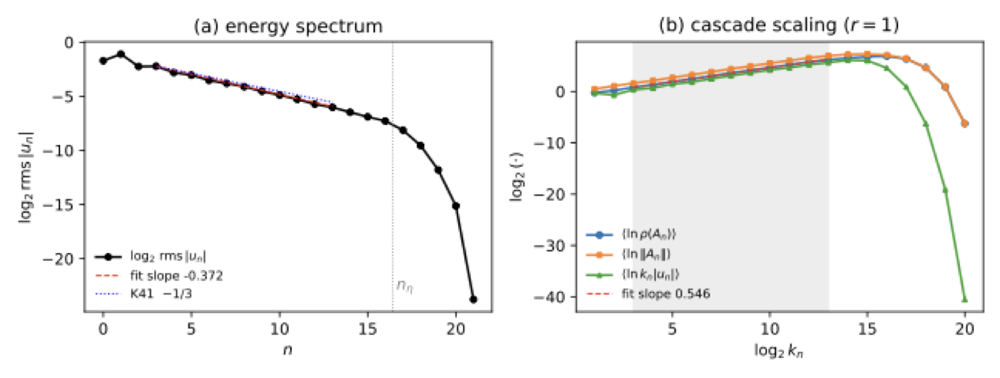
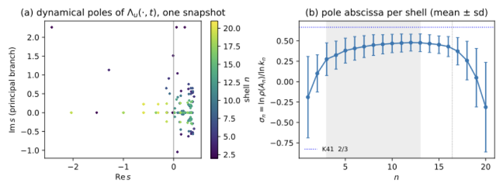
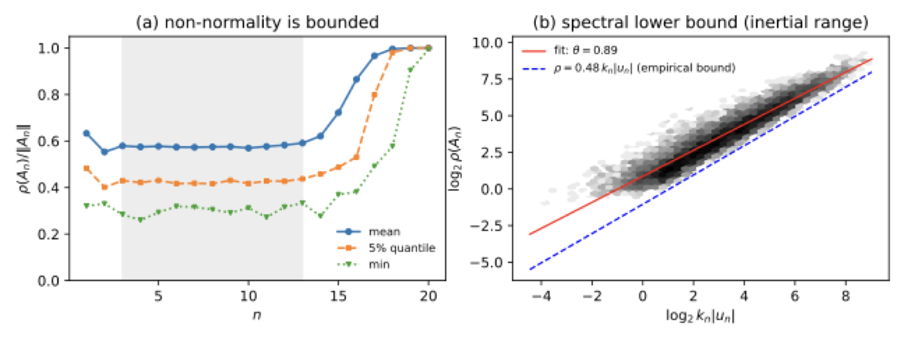

# An Euler Product for the Energy Cascade

**Pole fronts, temperedness, and the limits of the *L*-function analogy**

*Václav Knapp*

This repository contains the companion code and figures for the paper *An Euler
product for the energy cascade: pole fronts, temperedness, and the limits of the
$L$-function analogy* (July 2026). It reproduces every numerical result and all
of the verification checks reported in the paper.

---

## Overview

To a solution $u$ of the 3D incompressible Navier–Stokes equations we associate a
**spectral determinant**

$$
D_u(s,t)=\prod_{j\ge 1}\det\!\bigl(I-A_j(t)\,\lambda_j^{-s}\bigr),
\qquad
\Lambda_u(s,t)=\Gamma_\infty(s)\,D_u(s,t)^{-1},
$$

an Euler-type product over dyadic scales $\lambda_j = 2^j$ built from finite-rank
Littlewood–Paley **energy-transfer operators** $A_j(t)$ — in loose analogy with
completed $L$-functions. The paper develops this analogy rigorously and, just as
importantly, *delimits* it:

- **Well-posed construction.** On the torus each shell has finitely many modes, so
  the local factors are classical determinants; the product converges on a right
  half-plane for every Leray–Hopf solution.
- **Meromorphic continuation from smoothing, not symmetry.** Along strong solutions
  the Foias–Temam Gevrey regularization makes $D_u(\cdot,t)$ **entire** — the
  continuation is a consequence of parabolic smoothing, not of a functional equation.
- **An exact regularity dictionary.** Pole confinement is *equivalent* to a
  $\dot B^{1}_{\infty,\infty}$ bound on the velocity, which is in turn equivalent to
  regularity. The determinant *repackages*, but cannot by itself reduce, the
  regularity problem.
- **No functional equation.** In the tempered normalization no identity
  $\Lambda_u(s,t)=\varepsilon(t)\,\Lambda_u(1-s,t)$ can hold — a precise breaking
  point of the number-theoretic analogy.
- **A solvable sandbox: the Sabra shell model.** The transfer matrices are computed
  in closed form; the per-shell Jacobian block vanishes identically, forcing a
  *windowed* construction, for which $\Lambda_u$ is meromorphic on $\mathbb{C}$
  unconditionally.
- **The pole front of turbulence.** In a verified statistically-steady turbulent
  state, the pole front advances with the intermittency-corrected cascade exponent,
  and a spectral lower bound holds across all inertial-range samples.

> The picture is double-edged, and stated plainly in the paper: the determinant is a
> well-defined, computable object whose analytic features are theorems and whose pole
> front carries real physical information — but it **cannot decide regularity**, and
> the Millennium Problem is untouched by this work.

---

## Key numerical results

The companion script `run_sabra.py` integrates the viscous Sabra model and computes
the spectral structure of $\Lambda_u$ in a statistically steady turbulent state
(**22 shells, 1000 decorrelated snapshots**). All results below are reproduced
verbatim by the code.

| Quantity | Value | Reference |
|---|---|---|
| Pole-front slope $\mathrm{d}\langle\ln\rho(A_n^{(1)})\rangle/\mathrm{d}\ln k_n$ | $0.549 \pm 0.007$ | Fig. B |
| Typical-amplitude cascade exponent $\mathrm{d}\langle\ln k_n\lvert u_n\rvert\rangle/\mathrm{d}\ln k_n$ | $0.541$ | independent measurement |
| **Agreement** | **within 1.5 %** | — |
| Spectral lower bound $\rho(A_n^{(1)}) / (k_n\lvert u_n\rvert)$ | $\ge 0.53$ over **all 11,000** samples | Fig. C |
| Non-normality index $\rho(A_n^{(1)})/\lVert A_n^{(1)}\rVert$ | $\ge 0.25$ (mean $0.58$) | Fig. C |
| Energy-balance closure (stationarity) | $0.6\%$ | check C3 |
| Closed-form vs. finite-difference Jacobian | rel. error $6.2\times 10^{-13}$ | check C2 |
| Inviscid energy-conservation drift | $1.1\times 10^{-14}$ | check C1 |

The pole front of $\Lambda_u$ thus **reads off the intermittency-corrected
Kolmogorov exponent** (the non-intermittent value being $2/3$).

---

## Figures

### Fig. A — Energy spectrum and cascade scaling



*(a)* Time-averaged energy spectrum, fitted slope $-0.373$ (Kolmogorov: $-1/3$),
with the dissipative cutoff at $n_\eta \approx 16.4$. *(b)* Cascade scaling of the
mean-log spectral radius $\langle\ln\rho(A_n^{(1)})\rangle$, operator norm
$\langle\ln\lVert A_n^{(1)}\rVert\rangle$, and local amplitude
$\langle\ln k_n\lvert u_n\rvert\rangle$: the three run parallel through the inertial
range (shaded) with fitted pole-front slope $0.549$, and all plunge in the
dissipation range — the Gevrey mechanism made visible.

### Fig. B — The pole front of $\Lambda_u$



*(a)* Dynamical poles $s=\log\alpha/\log k_n$ of $\Lambda_u(\cdot,t)$ for one
snapshot, colored by shell: inertial-range shells cluster along a front at
$\mathrm{Re}\,s \approx 0.4$–$0.6$; dissipation-range shells dive to negative
abscissae. *(b)* Per-shell pole abscissa $\sigma_n$ (mean $\pm$ sd over 1000
snapshots): a plateau across the inertial range below the Kolmogorov asymptote
$2/3$, then the dissipative plunge.

### Fig. C — The spectral lower-bound question



*(a)* Non-normality index $\rho(A_n^{(1)})/\lVert A_n^{(1)}\rVert$ per shell — bounded
away from $0$ everywhere. *(b)* Pooled inertial-range scatter of $\rho(A_n^{(1)})$
against $k_n\lvert u_n\rvert$ (log–log density), with power-law fit ($\theta = 0.89$)
and the empirical uniform bound $\rho \ge 0.53\, k_n\lvert u_n\rvert$.

---

## The model

The viscous Sabra shell model evolves complex amplitudes $u_n(t)$ with wavenumbers
$k_n = k_0\mu^n$:

$$
\dot u_n = i\bigl(a\,k_{n+1}u_{n+2}\bar u_{n+1} + b\,k_n u_{n+1}\bar u_{n-1} - c\,k_{n-1}u_{n-1}u_{n-2}\bigr) - \nu k_n^2 u_n + f_n,
$$

with $a+b+c=0$ (energy conservation). The default configuration matches the paper:

| Parameter | Value |
|---|---|
| Shells $N$ | 22 |
| $\mu,\; k_0$ | $2,\; 1$ |
| Coefficients $a,b,c$ | $1,\; -\tfrac12,\; -\tfrac12$ |
| Viscosity $\nu$ | $10^{-7}$ |
| Forcing | $f_1 = 0.1(1+i)$ on shell 1 |
| Time step | $10^{-4}$ (integrating-factor RK4) |
| Transient / sample window | $60$ / $200$ time units → 1000 snapshots |

Because the nonlinearity involves complex conjugates, its derivative is
$\mathbb{R}$-linear but not $\mathbb{C}$-linear, so the transfer matrices live on the
realification $\mathbb{C}\cong\mathbb{R}^2$. The **windowed transfer operators**
$A_n^{(r)}$ are compressions of the realified Jacobian to a window of $2r+1$ shells
($r=1$: $6\times 6$; $r=2$: $10\times 10$), whose spectra give the dynamical poles.

---

## Repository layout

```
.
├── run_sabra_model.py        # main driver: integration, verification, spectral analysis
├── create_figures.py         # regenerates figA/figB/figC from results/
├── figures/                  # figA.pdf, figB.pdf, figC.pdf (paper-quality)
├── assets/                   # PNG figures for this README
└── results/
    ├── results.json          # all scalar results and per-shell statistics
    └── poles_data.npz        # per-snapshot spectra, amplitudes, pole abscissae
```

---

## Reproducing the results

### Requirements

- Python 3.9+
- NumPy
- Matplotlib (only for `make_figs.py`)

```bash
pip install numpy matplotlib
```

### Run

```bash
mkdir -p results figures
python run_sabra_model.py     # integrates the model, runs checks C1–C4, writes results/
python create_figures.py      # regenerates figA/figB/figC from results/
```

`run_sabra_model.py` prints the verification checks and key exponents to stdout, and writes
`results/results.json` and `results/poles_data.npz`. The run is fully deterministic
(fixed RNG seed), so the numbers reproduce the table above exactly.

### What the code enforces

The four correctness checks from §7.1 of the paper are asserted programmatically:

- **C1 — Energy conservation** of the inviscid, unforced model.
- **C2 — Jacobian**: closed-form vs. central finite differences.
- **C3 — Stationarity**: energy input balances dissipation.
- **C4 — Spectrum**: inertial-range slope consistent with intermittent Kolmogorov scaling.

---
## License

Released under the MIT License. See [`LICENSE`](LICENSE) for details.

---

*Questions or comments are welcome — please open an issue.*
